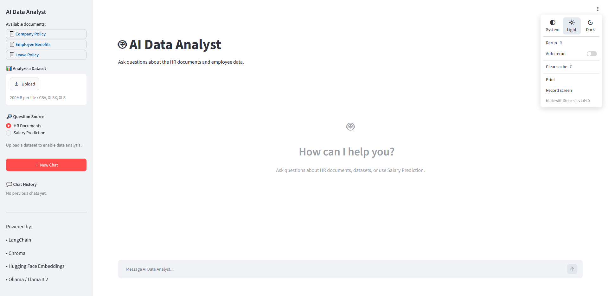
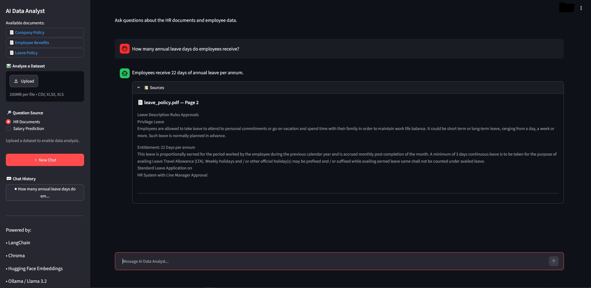
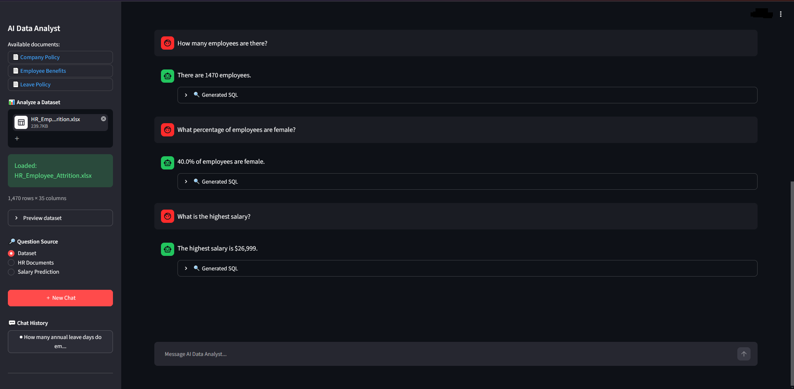
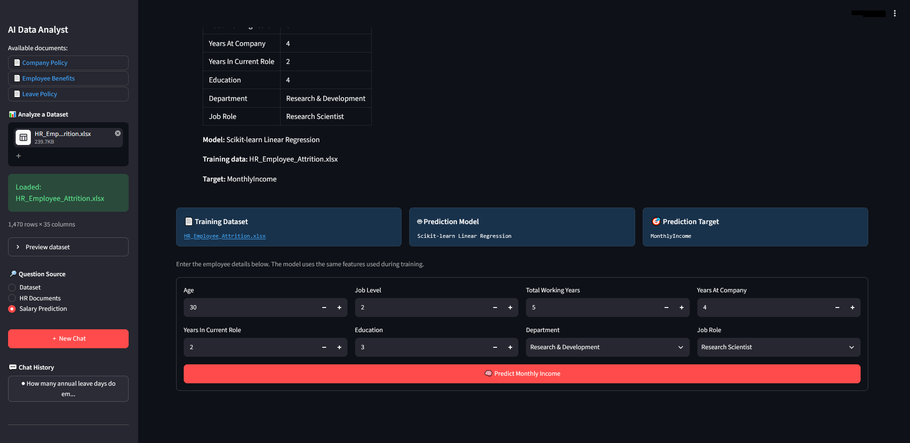
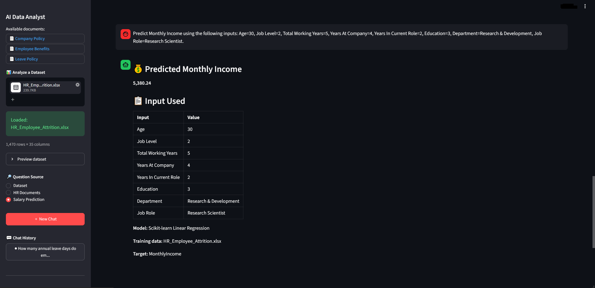

# AI Data Analyst

An AI-powered data analysis application that combines data analysis,
RAG-based document question answering, and machine learning.

## Features

- AI-powered data analysis
- Excel/CSV data analysis
- Natural language data queries
- RAG-based document Q&A
- HR document analysis
- Salary prediction
- Machine learning model
- Chat history
- Source/document references
- Interactive Streamlit interface

## Technologies

- Python
- Pandas
- NumPy
- Scikit-learn
- LangChain
- Ollama
- Streamlit
- ChromaDB
- MySQL
- Git & GitHub

## Preview

**Homepage** 


**Home page with light theme** 


**Ai answering from documents** 


**Ai answering from dataset** 


**Ai salary prediction input** 


**Ai salary prediction output** 


## Project Structure

```text
AI_Data_Analyst/
├── data/
├── documents/
├── models/
├── src/
├── static/
├── app.py
├── requirements.txt
└── README.md
